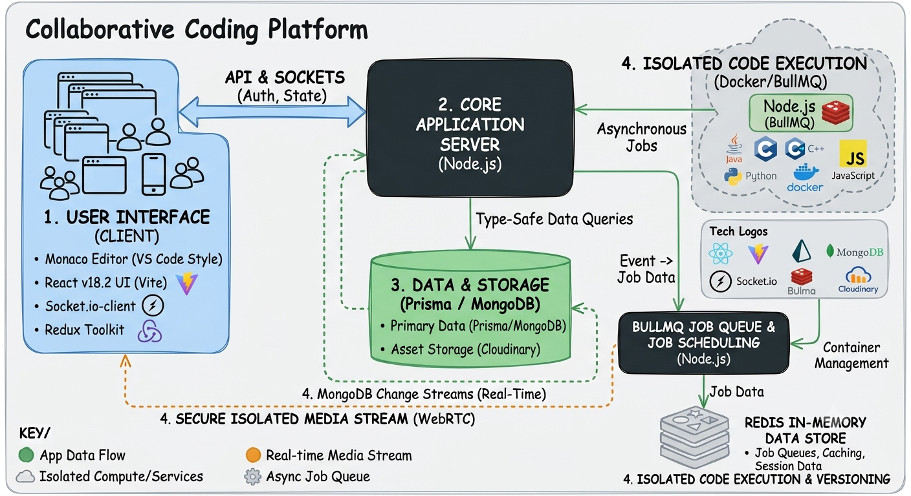

# CodexUnity ⚡💻

> A real-time collaborative code editor and multi-language remote execution engine built with React, Node.js, Socket.io, BullMQ, and Docker.

[](https://react.dev/)
[](https://nodejs.org/)
[](https://www.docker.com/)
[](https://bullmq.io/)
[](https://www.mongodb.com/)

---

## 📸 System Architecture



---

## ✨ Core Features

* **Real-Time Collaborative Editing:** Low-latency multi-user code synchronization powered by **Socket.io** and differential text-matching algorithms (`diff-match-patch`).
* **Multi-Language Isolated Code Execution:** Safe remote execution for **Java, C, C++, Python, and JavaScript** running inside isolated, resource-capped **Docker containers**.
* **Asynchronous Job Scheduling:** High-throughput task queue managed via **BullMQ** and **Redis** to prevent server bottlenecks during peak compilation loads.
* **VS Code-Style Editing Experience:** Rich editor interface featuring **Monaco Editor**, panel resizers (`react-resizable-panels`), and Redux Toolkit state management.
* **Version Control & In-Line Comments:** Real-time user discussions, line-by-line commenting, and project versioning snapshots stored in **MongoDB**.
* **Automated CI/CD Pipeline:** Integrated **Jenkins** build pipelines ensuring automated testing and deployment.

---

## 🛠️ Tech Stack

| Layer | Technologies |
| :--- | :--- |
| **Frontend UI** | React 18, Vite, Tailwind CSS, Monaco Editor, Framer Motion |
| **State & Data** | Redux Toolkit, Redux Persist, TanStack Query (React Query) |
| **Real-Time Layer** | Socket.io Client & Server, WebSockets |
| **Core Backend** | Node.js, Express, Mongoose (MongoDB ORM), JWT, Bcrypt |
| **Job Queue & Workers** | BullMQ, Redis In-Memory Store, Dockerode |
| **Sandboxed Execution** | Docker Engine (Isolated Linux Worker Containers) |
| **DevOps & CI/CD** | Jenkins, Docker Hub, ESLint |

---

## ⚡ Engineering Challenges & Solutions

### 1. Secure & Isolated Remote Code Execution
* **Challenge:** Executing untrusted user code directly on the application server poses severe security risks (e.g., infinite loops, memory leaks, malicious system calls).
* **Solution:** Orchestrated **Dockerode** to spawn ephemeral Docker containers with restricted CPU memory limits and network access disabled. Executions run in isolated sandboxes and self-destruct after execution or timeout.

### 2. High-Concurrency Compilation Management
* **Challenge:** Heavy compilation requests for languages like C++ or Java could block the Node.js event loop during peak traffic.
* **Solution:** Decoupled execution handling from the primary API server using **BullMQ** job queues backed by **Redis**. Code execution tasks are queued asynchronously, processed by background worker processes, and pushed back to the client via Socket.io events.

### 3. Conflict-Free Concurrent Text Editing
* **Challenge:** Race conditions and out-of-order text edits when multiple users write code in the same file simultaneously.
* **Solution:** Integrated operational text-differencing algorithms using `diff-match-patch` alongside debounced Socket.io state emissions to ensure smooth cursor tracking and consistent state across all clients.

---

## 🚀 Getting Started Locally

### 1. Prerequisites
* **Node.js:** `v18.x` or higher
* **Docker:** Installed and running locally
* **Redis Server:** Running locally or via Docker (`docker run -p 6379:6379 redis`)
* **MongoDB:** Connection URI (Local or Atlas)

### 2. Installation

```bash
# Clone the repository
git clone [https://github.com/harsh-1214/CodexUnity.git](https://github.com/harsh-1214/CodexUnity.git)
cd devsync

# Start the Client server
npm install
npm run dev

# Start the backend server
npm install
npm run dev

# Start the socket server
npm install
npm run dev 